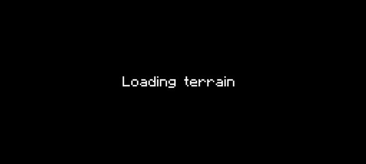

# 👋 Hola, soy David Lopez Velasco

💻 Full-Stack Developer en formación.

🚀 Apasionado por el desarrollo web, la automatización y la tecnología.

🎮 Amante de los videojuegos y las experiencias digitales.

🌱 Creando proyectos reales y aprendiendo cada día.

## 🛠️ Tecnologías

## 🚀 Proyectos destacados

* 🌐 daovez.dev
* 🎨 daovezstudio.com
* 💡 Proyectos personales y experimentos

## 🎯 Actualmente

* Aprendiendo desarrollo Full Stack
* Mejorando mis habilidades con Git y GitHub
* Construyendo proyectos reales
* Explorando el desarrollo de aplicaciones y videojuegos

## 📊 GitHub Stats

## 📫 Contacto

* 🌍 https://daovez.dev
* 💼 LinkedIn: [www.linkedin.com/in/david-lopez-velasco](http://www.linkedin.com/in/david-lopez-velasco)

---

> "La mejor forma de aprender es construyendo proyectos reales."

